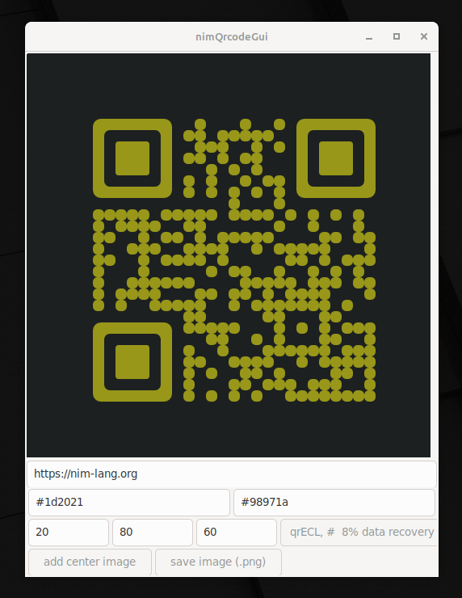

# nimQrcodeGui

A simple gui and cli application for QR code generation.

Should work on:

- Linux (tested)
- Windows (NOT tested)


You can use the gui to create an qr code or you can use the application as a command line app:

```
./nimQrcodeGui -h
Usage:
  cli [REQUIRED,optional-params] 
Options:
  -h, --help                                               print this cligen-erated help
  --help-syntax                                            advanced: prepend,plurals,..
  -t=, --text=                        string     REQUIRED  set text
  -a=, --alignmentPatternsRoundness=  int        REQUIRED  set alignmentPatternsRoundness
  -m=, --modulesRoundness=            int        REQUIRED  set modulesRoundness
  -s=, --separationOfTheModules=      int        REQUIRED  set separationOfTheModules
  -e=, --errorCorrection=             QRECLevel  REQUIRED  select 1 QRECLevel
  -c=, --centerImagePath=             string     ""        set centerImagePath
  -o=, --output=                      string     ""        set output
  -f=, --fg=                          string     "black"   set fg
  -b=, --bg=                          string     "white"   set bg
```

for example:

```
nimQrcodeGui -e qrECH -t https://nim-lang.org -s 60 -m 60 -a 100 -o /tmp/foo.png -c nimLogo.png -f '#f1f' -b black
```
